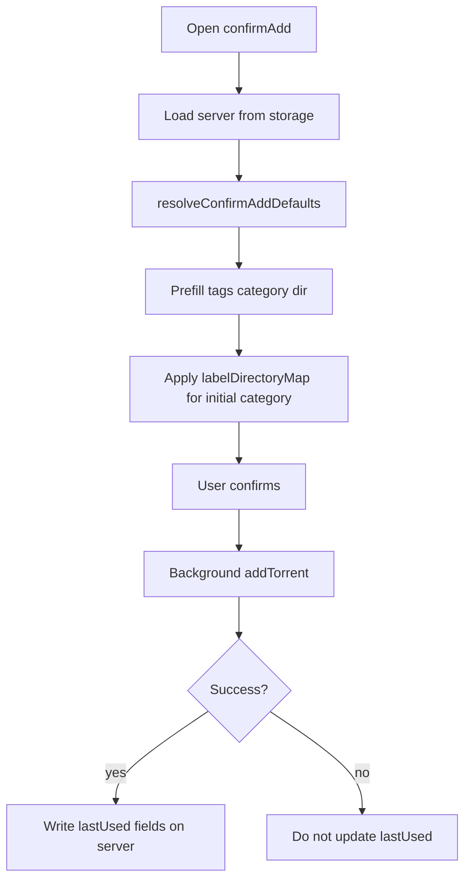

# Discovery, sticky confirm defaults, and ship-quality tests

**Date:** 2026-08-01  
**Status:** Approved in brainstorming (phased approach A + `bun test`)  
**Product:** Add Remote Torrent (`jgkme/Add-Remote-Torrent`)

## Goal

Improve Chrome Web Store / GitHub discovery and first impression without naming competitors; add low-risk sticky last-used label/dir/tags on Advanced Add with focused automated tests; prepare a pre-CWS soak checklist. **Do not publish to the Chrome Web Store in this work** — the maintainer publishes only after manual verification so existing users are not broken.

## Non-goals

- No Vitest / Vite migration (use `bun test` + existing `scripts/verify-dist-background.js`)
- No rqbit (or other new client) handler — niche relative to qBittorrent; does not move installs
- No website-style visual redesign of popup/options/dashboard (extension surfaces stay as-is)
- No public README comparison tables or competitor names/links
- No Chrome Web Store upload as part of implementation

## Decisions locked

| Topic | Choice |
| --- | --- |
| README hero | Polished product landing (centered brand, tagline, badges, TOC) |
| Public tone | Never name or mention competitors |
| Competitive analysis | Internal spec only (full field, not one rival) |
| Shipping shape | Phased: discovery → sticky+tests → checklist |
| Tests | `bun test` on extracted pure helpers for sticky/prefill |
| CWS | Checklist + soak; publish is manual later |

## Phase 1 — GitHub discovery + README

### 1.1 Repository metadata

Via `gh`:

- **Topics:** `chrome-extension`, `torrent-management`, `qbittorrent`, `manifest-v3`, `bittorrent`, `transmission`, `deluge`
- **Homepage:** Chrome Web Store listing URL for `holiffefjdehbfhliggafhhlecphpdof`
- **Description:** Keep factual multi-client WebUI add focus (no competitor language)

Also add `.superpowers/` to `.gitignore` so brainstorm companion artifacts are never committed.

### 1.2 README redesign

Replace the top of [`README.md`](../../README.md) with a landing structure:

1. Title + short tagline (one-click magnets/`.torrent` → remote clients)
2. Shields.io badges: CWS users, rating, version, and GitHub stars
3. Anchor TOC: Install · Features · Clients · Link catching · Shortcuts · Troubleshooting · Development · Changelog
4. **Features** bullets that sell real differentiators without naming rivals: multi-client + multi-server, optional on-page catching, advanced add (file select / client options), dashboard, RSS, Jackett/Prowlarr / qBit search, tracker→label/dir rules, private-tracker session download, local-only settings
5. **Supported clients** list (complete vs code in `api_handlers/api_client_factory.js`)
6. Keep existing how-to / FAQ / changelog content **below** the fold (edit for clarity; do not delete useful troubleshooting)

**Remove / soften from the hero:** “I used Cline + Gemini…” as the opening identity. Move any heritage note out of the first screen or drop it from public README entirely (preferred: drop competitor heritage line).

## Phase 2 — Sticky last-used + tags fix + tests

### 2.1 Behavior

When **Advanced Add** (`confirmAdd`) completes a **successful** add for a given server:

- Persist per-server last-used: category/label, tags string, download directory
- Storage: `chrome.storage.local` on the server object (or a sibling map keyed by server `id`) — prefer fields on the server profile:
  - `lastUsedCategory`
  - `lastUsedTags`
  - `lastUsedDownloadDir`

**Prefill order** when opening confirmAdd for that server:

1. `lastUsed*` if set and still valid for dropdown options (category/dir must exist in configured lists when lists are non-empty; free-form tags always apply)
2. Else profile defaults (`category` / `defaultCategory`, `tags`, configured dirs)
3. Apply `labelDirectoryMap` for the **initially selected** category (not only on `change`)

**Silent / non-dialog adds** keep using profile defaults + tracker rules + context-menu directory (unchanged). Sticky applies to confirmAdd path only.

### 2.2 Bug fix (same change set)

confirmAdd currently prefills `activeServer.defaultTags`; options saves `tags`. Prefill must use `tags` (with optional fallback to `defaultTags` for any old data).

### 2.3 Pure helpers + `bun test`

Extract testable functions (suggested module: `js/confirmAddDefaults.js` or `lib/confirmAddDefaults.js`):

- `parseLabelDirectoryMap(raw)` — align with background behavior
- `resolveConfirmAddDefaults({ server, lastUsed })` — returns `{ tags, category, downloadDir }`
- `shouldPersistLastUsed(result)` / shape helper for what to write after success

Add `package.json` script `"test": "bun test"`. Place tests under `test/` (e.g. `test/confirmAddDefaults.test.js`).

**Minimum cases:**

1. No last-used → profile `tags` + `defaultCategory`/`category`
2. Last-used category/tags/dir win over profile
3. Last-used category not in list → fall back to profile category
4. Initial category with map entry → directory from map
5. `defaultTags` alone still works as fallback if `tags` empty (migration)

Keep `scripts/verify-dist-background.js` as the post-webpack MV3 gate (unchanged role).

### 2.4 Manual soak (before any CWS publish)

Maintainer-run checklist (also Phase 3 doc):

- qBittorrent: confirmAdd sticky across two adds; tags prefill; category→dir map; silent add still uses defaults/rules
- At least one non-qBit client with labels/dirs if configured (Transmission or Deluge)
- Multi-server: sticky does not leak across server ids
- Link catching + context menu still work (smoke)
- Build: `bun run build` + verify script green; `bun test` green

## Phase 3 — Competitive spec (internal) + pre-CWS checklist

### 3.1 Competitive landscape doc

Write `docs/superpowers/specs/2026-08-01-competitive-landscape.md` covering:

- Multi-client Chrome incumbent (~30k users)
- qBittorrent-only managers (~5k)
- Transmission-only managers (~4k)
- Firefox Torrent Control (~8k) / Torrent Clipper
- Tiny single-client senders

Include: where we win (breadth, dashboard/RSS/search, optional catching), where discovery lags (README/topics/store currency), and **issue themes** from rivals that we already address or might later — without putting rival names in the public README.

### 3.2 Pre-CWS checklist

Maintainer-only steps: bump/verify store assets, permission justifications unchanged, upload zip from `dist-prod`/release pipeline when soak passes. Implementation does **not** run the upload.

## Architecture (Phase 2)

## Risks

| Risk | Mitigation |
| --- | --- |
| Sticky surprises users who rely on static defaults | Only update after successful confirmAdd; silent path unchanged; document in README Advanced Add blurb |
| Invalid last-used after user edits category list | Drop invalid category/dir to profile default |
| Tests drift from background map parser | Share one `parseLabelDirectoryMap` implementation |

## Success criteria

- GitHub topics set; README reads as a product landing page without competitor names
- Sticky last-used works per server on confirmAdd; tags prefill matches options field
- `bun test` covers resolver/map cases; webpack verify still passes
- Competitive landscape + pre-CWS checklist exist under `docs/superpowers/`
- No CWS publish performed by the agent

## Implementation order

1. `.gitignore` + GitHub topics/homepage  
2. README redesign  
3. Extract helpers + tests (TDD preferred)  
4. Wire confirmAdd + persistence  
5. Competitive landscape + pre-CWS checklist docs  
6. Maintainer soak → optional CWS publish (out of band)
