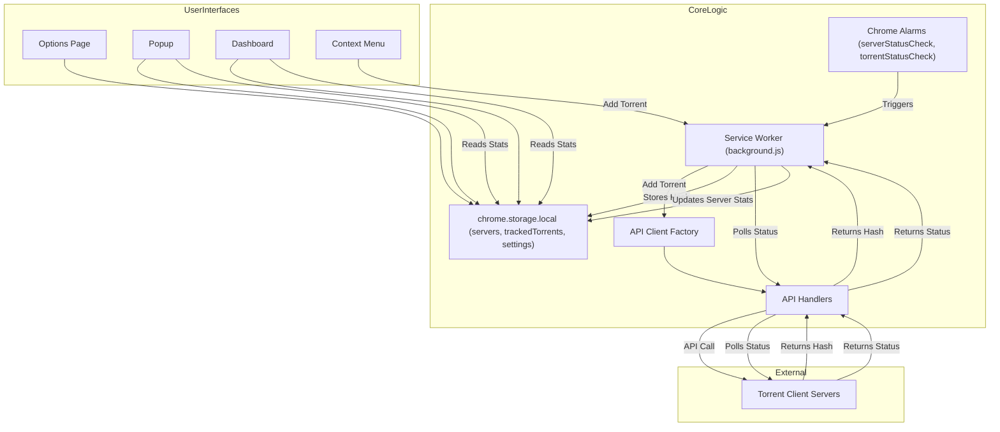

# System Patterns: Add Remote Torrent

## 1. Overall Architecture (Manifest V3)

-   **Service Worker (`background.js`):**
    -   Core logic for context menus, message handling, and API delegation.
    -   Manages all `chrome.alarms` for periodic tasks.
    -   **`serverStatusCheck` Alarm:** Periodically calls `testConnection` for all online servers to update their status, version, and stats (free space, torrent count, speeds). This data is stored in the `servers` array in `chrome.storage.local`.
    -   **`torrentStatusCheck` Alarm:** Manages the download completion notification system.
-   **API Handlers (`api_handlers/` directory):**
    -   Individual modules for each client, encapsulating all client-specific API logic.
    -   **Required Functions:** Each handler must export `addTorrent(...)`, `testConnection(...)`, and `getTorrentsInfo(...)` to be fully compatible with the extension's features.
-   **API Client Factory (`api_handlers/api_client_factory.js`):**
    -   A simple mapping that returns the correct API handler module based on a `clientType` string.
-   **Content Script (`content_script.js`) & Link Monitor (`LinkMonitor.js`):**
    -   Work together using a `MutationObserver` to find and attach click handlers to torrent links on web pages, including those loaded dynamically.
-   **Options Page (`options/`):**
    -   Manages server profiles (CRUD), URL-to-server rules, tracker-based rules, custom link-catching patterns, and global settings.
-   **Popup Page (`popup/`):**
    -   Allows manual selection of the active server, displays server details, and provides a manual add input.
-   **Dashboard Page (`dashboard/`):**
    -   Provides a full-page, detailed overview of all configured servers.
    -   Displays connection status, version, free space, total torrents, and live speed data.
    -   Allows users to trigger a manual refresh of all server statuses.
-   **`manifest.json`:**
    -   Defines permissions (`alarms`, host permissions), service worker, pages, and icons.

## 2. Key Technical Decisions & Patterns

-   **Configuration Storage (`chrome.storage.local`):**
    -   `servers`: The single source of truth for all server configurations. Each object contains credentials, settings, and the latest polled status data (version, freeSpace, torrents, uploadSpeed, downloadSpeed).
    -   `trackedTorrents`: An array of `{hash, serverId}` objects. This is the core of the new notification system. It stores torrents that were added by the extension and are pending completion.
    -   `enableCompletionNotifications`: A boolean flag to globally enable or disable the download completion notification feature.
-   **Targeted Notification System:**
    -   **Problem:** The old system polled all completed torrents, causing notification spam.
    -   **Solution:** The system is now targeted and stateful.
        1.  **Tracking:** When `addTorrent` in a handler succeeds and returns a `hash`, `background.js` adds the `{hash, serverId}` to the `trackedTorrents` array in storage.
        2.  **Polling:** The `torrentStatusCheck` alarm iterates through `trackedTorrents`. For each server with tracked torrents, it calls the new `getTorrentsInfo(server, hashes)` function in the corresponding API handler.
        3.  **Notifying & Cleanup:** If `getTorrentsInfo` reports a torrent as complete (e.g., `progress: 1`), a notification is fired. The torrent's hash is then removed from the `trackedTorrents` array to prevent future checks.
-   **Live Data on Dashboard & Popup:**
    -   The `serverStatusCheck` alarm is the primary mechanism for updating the live data (free space, speeds, etc.) for all servers.
    -   The dashboard and popup UIs are consumers of this data. They read the updated `servers` array from `chrome.storage.local` to display the latest information.
    -   The dashboard provides a "Refresh" button that manually triggers the `serverStatusCheck` alarm for immediate updates.
-   **API Handler Contract:**
    -   To support all features, each API handler must now implement three key functions:
        1.  `addTorrent(...)`: Must return `{ success: true, hash: '...' }` for new, successful additions to enable tracking.
        2.  `testConnection(...)`: Must return `{ success: true, data: { version, freeSpace, torrentsInfo: { total, downloadSpeed, uploadSpeed } } }` to populate the dashboard and popup.
        3.  `getTorrentsInfo(server, hashes)`: Must accept an array of hashes and return information about their status, including a `progress` or `isCompleted` flag.
-   **Dynamic Permissions:**
    -   When a new server URL is saved, the extension uses `chrome.permissions.request` to ask for host permission for that specific origin. This avoids requesting overly broad permissions at install time.

## 3. Component Relationships



## 4. Build and Deployment Architecture

(No changes to this section, the existing documentation is accurate.)

The project uses a scripted process to ensure consistent and secure releases.

```mermaid
graph TD
    subgraph "Local Development"
        A[Source Code] --> B{pnpm build};
    end

    subgraph "Build Process"
        B --> C[Webpack Compilation];
        C --> D[dist/ folder];
        D --> E[scripts/zip.js];
    end

    subgraph "Packaging & Signing"
        E --> F[add-remote-torrent.zip];
        E --> G[add-remote-torrent.zip.sha256];
        E --> H[add-remote-torrent.crx];
    end
    
    subgraph "Deployment"
       F & G & H --> I{gh release upload};
       I --> J[GitHub Release];
    end

    subgraph "Store Submission"
        H --> K[Chrome Web Store];
    end
