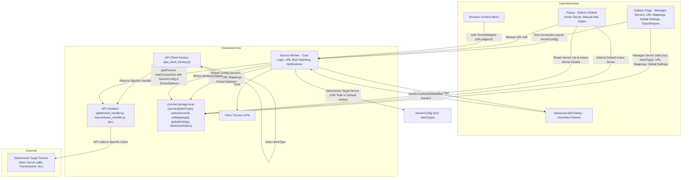

# System Patterns: Add Remote Torrent

## 1. Overall Architecture (Manifest V3)

-   **Service Worker (`background.js`):**
    -   Core logic for context menus, message handling (from options/popup), and determining target server.
    -   Uses `api_client_factory.js` to get the appropriate client API handler based on `serverConfig.clientType`.
    -   Delegates actual API communication (add torrent, test connection) to the specific client handler.
    -   Manages URL-based server selection logic.
    -   Handles notifications.
    -   **Stricter Content-Type Check:** Aborts add operation if `Content-Type` is not a recognized torrent type, preventing non-torrent links from being sent to the client.
-   **API Handlers (`api_handlers/` directory):**
    -   Contains individual JavaScript modules for each supported torrent client (e.g., `qbittorrent_handler.js`, `transmission_handler.js`, `deluge_handler.js`, `rutorrent_handler.js`).
    -   Each handler encapsulates the specific API logic (authentication, request formatting, endpoint URLs, response parsing) for its client type.
    -   Exports common functions like `addTorrent(torrentUrl, serverConfig, torrentOptions)` and `testConnection(serverConfig)`.
-   **API Client Factory (`api_handlers/api_client_factory.js`):**
    -   Imports all individual client handlers.
    -   Provides a `getClientApi(clientType)` function that returns the appropriate handler module.
-   **Content Script (`content_script.js`):**
    -   Injects a `LinkMonitor` to dynamically detect torrent links on the page.
    -   Adds click handlers to torrent links, which send an `addTorrent` message to the service worker.
    -   Only prevents the default browser action for confirmed torrent links.
    -   Dynamically injects and removes CSS for the on-page modal to prevent style leakage.
-   **Link Monitor (`LinkMonitor.js`):**
    -   Uses a `MutationObserver` to watch for new `<a>` tags being added to the DOM and for changes to the `href` attribute of existing links.
    -   This allows the extension to detect torrent links on dynamic pages that load content asynchronously.
-   **Options Page (`options/options.html`, `options.js`):**
    -   Manages server profiles (CRUD), including selecting `clientType` and client-specific settings.
    -   Includes a button to open the server's WebUI in a new tab.
    -   Allows users to define a list of download locations for Transmission servers.
    -   Manages URL-to-Server mapping rules.
    -   Handles global settings (advanced dialog toggle, URL-based selection toggle).
    -   Manages settings export/import.
-   **Popup Page (`popup/popup.html`, `popup.js`):**
    -   Allows manual selection of the "default active" server.
    -   Displays details of the active server (including client type).
    -   Allows manual torrent URL input.
    -   Shows last action status.
-   **Advanced Add Dialog (`confirmAdd/`):**
    -   Allows overriding default torrent parameters before adding.
-   **Add Torrent Dialog (`add/`):**
    -   A simple dialog that allows users to add a torrent by pasting a URL or magnet link.
-   **`manifest.json`:**
    -   Defines permissions, background service worker (as ES module), options page, popup, and content menu integration.
    -   Updated with new project name and description.

## 2. Key Technical Decisions & Patterns (Expanded)

-   **Configuration Storage (`chrome.storage.local`):**
    -   `servers`: Array of server objects. Each object now includes a `clientType` field (e.g., "qbittorrent", "transmission", "deluge") in addition to `id`, `name`, `url`, `username`, `password`, `tags`, `category`, `addPaused`.
    -   `activeServerId`: ID of the manually selected default server.
    -   `urlToServerMappings`: Array of objects, e.g., `{ id: "map_uuid", websitePattern: "example.com", serverId: "server_uuid" }`.
    -   `enableUrlBasedServerSelection`: Boolean.
    -   `advancedAddDialog`: String (`never`, `always`, `manual`, `catch`).
    -   `lastActionStatus`: String.
-   **Dynamic Link Detection:**
    -   A `MutationObserver` in `LinkMonitor.js` is used to detect changes to the DOM, allowing the extension to find torrent links on dynamic pages.
    -   The `content_script.js` uses this monitor to attach click handlers to new links as they appear.
-   **Torrent Client API Interaction:**
    -   Abstracted through client-specific handlers in the `api_handlers` directory.
    -   `background.js` uses `api_client_factory.js` to retrieve the correct handler for the determined target server's `clientType`.
    -   Each handler implements a consistent interface (e.g., `addTorrent`, `testConnection`) but handles the unique API details for its client.
    -   **qBittorrent Version Handling:** The `qbittorrent_handler.js` now includes a version check to automatically detect the qBittorrent version. It then uses the `stopped` parameter instead of `paused` for qBittorrent versions >= 5.1.2 to ensure compatibility.
-   **Context Menu Integration:** (Largely as before, but now triggers generic `addTorrentToClient` in `background.js`).
-   **Icon Click:**
    -   Clicking the extension icon opens a simple dialog (`add/add.html`) where the user can paste a torrent URL or magnet link.
    -   The dialog sends a message to the background script, which then calls `addTorrentToClient` to add the torrent.
-   **Active Server Determination Logic (in `background.js`):**
    1.  On context menu click, get `info.pageUrl`.
    2.  Read `enableUrlBasedServerSelection` and `urlToServerMappings` from storage.
    3.  If enabled and mappings exist:
        *   Iterate `urlToServerMappings` (respecting order for priority).
        *   For each rule's `websitePattern`:
            *   If pattern starts `http(s)://`: prefix match against `info.pageUrl`.
            *   Else (domain pattern): extract hostname from `info.pageUrl`. Check if hostname is identical to pattern OR if hostname ends with `.` + pattern.
            *   If match found, use this rule's `serverId`. This becomes the target server for this action.
    4.  If no rule matched or feature disabled: use `activeServerId` (manually selected default) from storage.
    5.  Retrieve full server config for the determined target server ID from the `servers` array.
-   **Export/Import:** Will now include `urlToServerMappings` in the JSON.
-   **Advanced Add Dialog Workflow:** (As before - uses determined target server).

## 3. Component Relationships (Updated for URL-Based Selection)

## 4. Future Considerations
(As previously noted).
